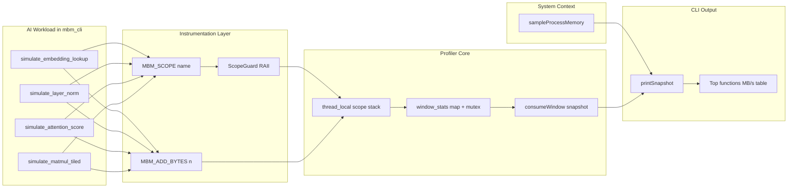

# Memory Bandwidth Monitor for AI (C++)

A real-time CLI tool that estimates memory bandwidth and shows which functions are driving it.

## What this tool does

- System mode (default):
  - System physical memory used/free/committed
  - Measured read+write memory bandwidth from a short system memory probe
- Demo/instrumentation mode:
  - Real-time throughput view (windowed MB/s)
  - Per-function impact table:
  - Function name
  - Calls in interval
  - Bytes touched in interval
  - Estimated MB/s contribution
  - Average latency per call
- External process mode:
  - Monitor another process by PID or executable name
  - Working set
  - Private bytes
  - Page-fault rate
  - Explicitly reports that external-process bandwidth needs a hardware-counter backend

## Why this is useful for AI apps

Many AI workloads are memory-bound in embedding lookup, attention, and normalization paths.
This tool helps answer: "Which function increases memory traffic right now?"

For another running application, this tool currently answers a narrower first question:
"How is this process memory footprint changing right now?"

## Architecture



## Build (Windows)

Requirements:
- CMake 3.20+ (CMake 4.2+ is required when using Visual Studio 2026 generator)
- A C++20 compiler (MSVC recommended on Windows)

Build commands:

```powershell
cmake -S . -B build -DCMAKE_BUILD_TYPE=Release
cmake --build build --config Release
```

MSBuild directly (auto-detect from installed Visual Studio):

```powershell
.\scripts\use-msbuild.ps1
```

Run MSBuild with arguments (example):

```powershell
.\scripts\use-msbuild.ps1 .\build-vs\memory_bandwidth_monitor_for_AI.slnx /t:mbm_cli /p:Configuration=Release /p:Platform=x64
```

Note:
- In this environment, Visual Studio Professional 2026 is installed.
- Use this configure command for Visual Studio 2026:

```powershell
"C:\Program Files\CMake\bin\cmake.exe" -S . -B build-vs -G "Visual Studio 18 2026" -A x64
```

- CMake 4.x with Visual Studio 2026 generates `.slnx` by default.

Binary:
- `build/Release/mbm_cli.exe` (multi-config generator)
- or `build/mbm_cli` (single-config generator)

## Run

Default system memory bandwidth view:

```powershell
./build/Release/mbm_cli.exe
```

Tune the bandwidth probe:

```powershell
./build/Release/mbm_cli.exe --workers 4 --probe-mb 256 --interval-ms 500
```

Override the theoretical RAM bandwidth used as the 100% scale:

```powershell
./build/Release/mbm_cli.exe --theoretical-gbs 51.2
```

Override the displayed theoretical GPU VRAM bandwidth:

```powershell
./build/Release/mbm_cli.exe --gpu-vram-gbs 456
```

Demo mode (generates AI-like workloads and profiles them):

```powershell
./build/Release/mbm_cli.exe --demo --workers 4 --interval-ms 500
```

Run for a fixed duration:

```powershell
./build/Release/mbm_cli.exe --demo --duration-sec 10
```

List selectable devices:

```powershell
./build/Release/mbm_cli.exe --list-devices
```

Select CPU or GPU target:

```powershell
./build/Release/mbm_cli.exe --device cpu
./build/Release/mbm_cli.exe --device gpu --gpu-index 0
```

Monitor another process:

```powershell
./build/Release/mbm_cli.exe --pid 1234
./build/Release/mbm_cli.exe --process-name python.exe
```

External process mode can be combined with device selection:

```powershell
./build/Release/mbm_cli.exe --process-name python.exe --device gpu --gpu-index 0
```

Stop with `Ctrl+C`.

## Integrate into your own AI code

Include and instrument key functions:

```cpp
#include "mbm/mbm_profiler.hpp"

void attention_kernel(float* q, float* k, float* out, std::size_t n) {
	MBM_SCOPE("attention_kernel");
	// read q + k, write out
	MBM_ADD_BYTES((2ULL * n + n) * sizeof(float));
	// ... actual kernel logic ...
}
```

Notes:
- `MBM_SCOPE("name")` measures elapsed time and call count.
- `MBM_ADD_BYTES(x)` records logical bytes touched by the current scope.
- The reported MB/s is an estimate based on the bytes you annotate.

## Limitations

- Default system mode measures read+write bandwidth with a short memory probe, not direct DRAM hardware counters.
- Demo mode is function-level estimated bandwidth, not direct DRAM hardware counter sampling.
- Accuracy depends on correct byte annotations in hot paths.
- `--pid` and `--process-name` monitor process memory state only. They do not yet report CPU/GPU memory bandwidth for that process.
- GPU selection currently identifies the target adapter in the CLI output; bandwidth values still come from `MBM_ADD_BYTES` annotations, not GPU hardware counters.
- For CPU-uncore hardware counters, platform-specific tools (for example Intel PCM) are needed.

## Output example (simplified)

```text
MBM system memory monitor                   device CPU
Window: 675 ms   Workers: 6   Probe: 256 MB   Max: 51.2 GB/s   Sample: 174 ms
 RAM  [||||||||||||||||||                      ]    14.2 GB /    31.7 GB  load 44%
 Free [||||||||||||||||||||||                  ]    17.5 GB available
 Cmit [|||||||||||||||||||                     ]    23.7 GB /    50.9 GB committed
 BW   [|||||||||||||||||||||||||               ]    32.6 GB/s /  51.2 GB/s   64% measured read+write
 VRAM [|||                                     ]     1.7 GB /    23.8 GB    7% dedicated usage
 VBW  [||||||||||||||||||||||||||||||||||||||||]   456.0 GB/s theoretical GPU[0] Intel(R) Arc(TM) Pro~
```
